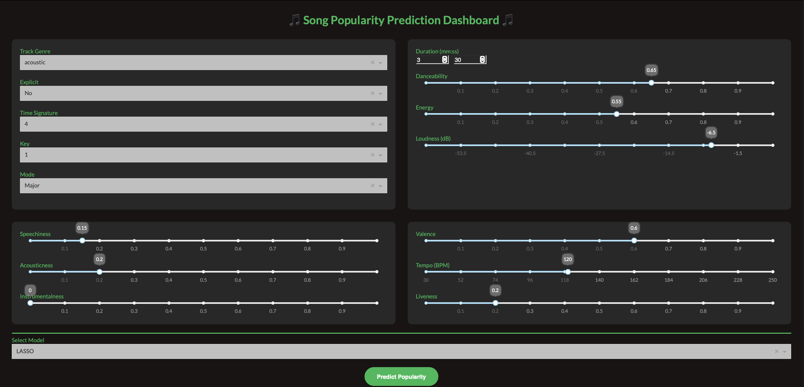
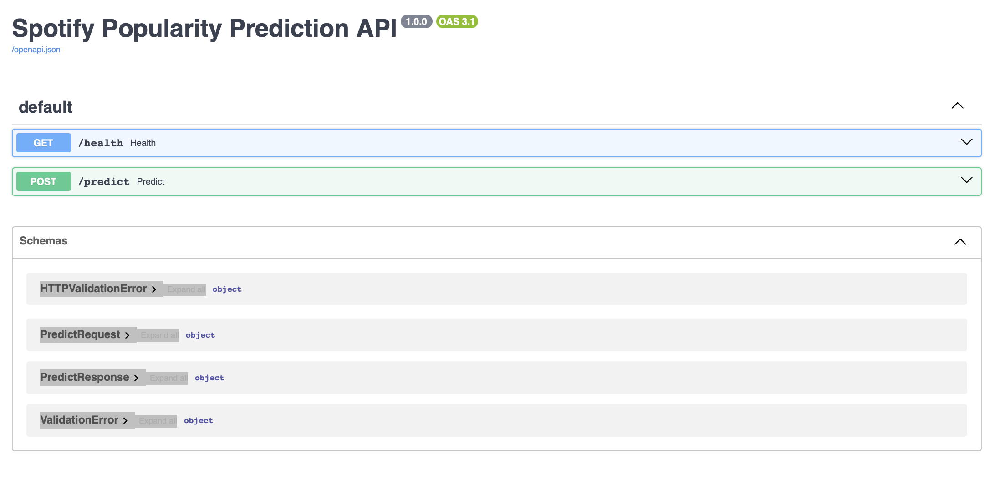

# Song Popularity Prediction Dashboard

This repository contains a full machine learning deployment pipeline for predicting Spotify song popularity.  
It includes model training, a FastAPI backend, and an interactive Dash frontend for real-time prediction.

---

## Dashboard (Dash Frontend)

The dashboard allows users to input Spotify audio features and generate real-time popularity predictions.

Key inputs include:
- Genre, explicit flag, time signature, key, mode  
- Danceability, energy, loudness  
- Speechiness, acousticness, instrumentalness  
- Valence, tempo (BPM), liveness  
- Model selection (LASSO, Random Forest, XGBoost)

---

## API Service (FastAPI Backend)

The backend exposes a REST API that serves model predictions.

Endpoints:
- `GET /health` – basic service health check  
- `POST /predict` – returns the predicted popularity score for a given set of audio features  

The API is documented automatically using OpenAPI (Swagger UI).

---

## Architecture Overview

Model Training (Jupyter Notebook)  
→ Serialized Model Artifact  
→ FastAPI Prediction Service  
→ Dash Frontend Interface  
→ User Inputs → Real-Time Popularity Prediction  

This structure demonstrates an end-to-end ML workflow, covering model development, backend engineering, and user-facing deployment.
